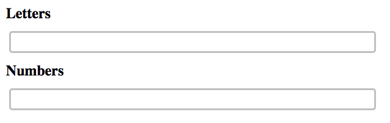

# Grok Submodules
I had to understand submodules for work, and I made this as a learning exercise. The repositories that have been listed as submodules for this "app" are here:
- https://github.com/bacalj/grok-submodules-numbers-plugin
- https://github.com/bacalj/grok-submodules-letters-plugin

## How to use this repo to practice submodule stuff
This project, when its submodules are included and running, lists some letters and some numbers.  It doesn't work until you get the submodules in. You can change the letters and numbers that appear on the page by checking out different commits within the submoudles.  How to do it:

1. Clone down the repository
```bash
$ git clone https://github.com/bacalj/grok-submodules-app.git
```

2. Serve or load the page as is
```bash
$ cd grok-submodules-app
$ php -S localhost:1122
```
You will just see a page like this. 




The actual letters and numbers are going to be pulled in as features ...in a submodule 😨. 

3. You will also see there are two empty directories in your app
```bash
$ ls
grok-submodules-letters-plugin  
grok-submodules-numbers-plugin  
readme.md
index.html
```

5. Those are the directories that only know to be in there because of what you see in the `.gitmodules` file.  They are listed in that file as submodules of this repository.  The directory is there, but the code is not. 

```txt
#.gitmodules

[submodule "grok-submodules-numbers-plugin"]
	path = grok-submodules-numbers-plugin
	url = https://github.com/bacalj/grok-submodules-numbers-plugin
[submodule "grok-submodules-letters-plugin"]
	path = grok-submodules-letters-plugin
	url = https://github.com/bacalj/grok-submodules-letters-plugin
```

... to be continued
